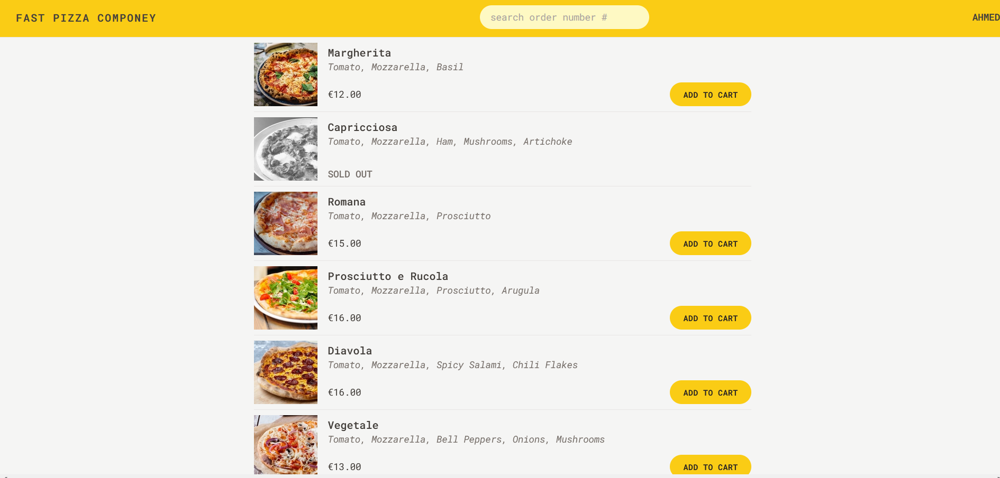

# Pizza Ordering App

## Overview

The Pizza Ordering App is a dynamic React application designed to provide users with an intuitive platform for ordering pizzas online. The app incorporates advanced state management with Redux and features real-time interaction with a RESTful API to enhance user experience. It allows users to browse a variety of pizza options, manage their cart, and place orders with ease.

## Key Features

- **Interactive Menu**: Users can view a comprehensive list of pizzas, complete with descriptions, images, and prices. They can easily add items to their cart and customize their orders.
- **Cart Management**: Users can add, update, or remove items from their cart. The cart dynamically updates to reflect changes and provides a summary of the selected items.
- **Order Placement**: Seamless order placement with an option to select priority service. Users can input delivery details and review their order before confirming.
- **Order Tracking**: Track the status of orders in real-time. Users can view the progress of their orders and make adjustments if necessary.
- **User Experience**: Intuitive navigation and responsive design ensure a smooth and engaging experience across devices.

## Technologies Used

- **React**: For building a responsive and interactive user interface.
- **Redux**: For managing the application's state in a predictable manner.
- **React Router**: For handling navigation and routing within the app.
- **Tailwind CSS**: For creating a modern, clean design with utility-first styling.
- **REST API**: For interacting with the backend to fetch pizza data and manage orders.

## Usage

1. On the homepage, enter your name to start the ordering process.
2. Browse through the pizza menu, add items to your cart, and customize your selections as needed.
3. Access the cart to review your choices and proceed to checkout.
4. Fill in your delivery information, select your service priority, and place your order.
5. Monitor your order's progress and make any necessary adjustments

# Contributing

Contributions are welcome! To contribute:

    Fork the repository.
    Create a new branch for your feature or bug fix.
    Make your changes and ensure they are tested.
    Submit a pull request detailing your changes and improvements

## Installation

1. Clone the repository:

   ```bash
   git clone https://github.com/Ahmed-K-Fouda/pizza-ordering-app.git

   ```

2. install dependencies:

   ```
   npm install

   ```

3. Start the application:

    ```
    npm run dev

    ```

# screenshoot



# Live demo

<!-- https://pizza-ordering-app.netlify.app/ -->
